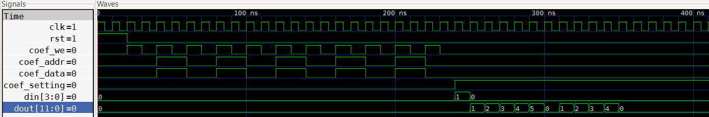
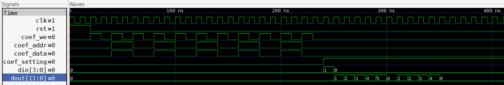

## Lab description
This VHDL project implements a parameterizable FIR filter using two alternative architectures derived from the reference structures in [Book Circuit Desing with VHDL, Volnei A, Pedroni, Fig. 2.35]: a direct-form chain of adders and a pipelined transposed version. Shared types, constants, and default coefficients are defined in a dedicated package to ensure modularity and code reuse. The direct architecture performs sequential accumulation, resulting in a longer critical path, while the pipelined architecture registers intermediate sums to improve timing without changing the transfer function. 

The design was initially developed with fixed coefficients and later extended to support runtime-programmable coefficients through a dedicated write interface that guarantees safe updates and filter integrity. 

Although not included, a tree-based FIR architecture could also be added for logarithmic adder depth and higher performance.

The design of an FIR filter with custom coefficients is not the purpose of this exercise.

## Verification description
The verification environment includes a dedicated testbench file (*_tb.vhd) and a run.sh script that automates compilation and simulation using GHDL, with waveform visualization through GTKWave. 

Both FIR architectures are simulated via VHDL configurations, allowing the same testbench to validate each implementation without code changes. During simulation, programmable coefficients are written sequentially through the coefficient interface, replacing the default values. 

An impulse input is then applied so that the output sequence directly reflects the coefficient set, providing a straightforward functional check. An assertion-based process automatically compares each output sample against the expected coefficient value, reporting mismatches as errors. 

This approach verifies correct coefficient loading, data propagation, and architectural equivalence in a single automated simulation flow.

## Simulation results
Both simulations produce identical outputs for the two architectures, as shown in the waveform captures below, confirming functional equivalence. In both cases the observed latency is one clock cycle. For a real FPGA implementation, timing would be dominated by the combinational path: in the first architecture the delay is approximately one multiplier plus a chain of adders proportional to the number of coefficients, while in the second architecture it is mainly the multiplier delay, allowing significantly higher achievable clock frequencies. 

It is worth noting that the second architecture, as presented in the reference book, may contain a conceptual issue: its latency should scale with the number of registers (i.e., the filter order), but this is not observed because the input sample is not registered before being multiplied by each coefficient. 

Finally, verification could be further strengthened by applying additional stimulus signals beyond the impulse test, such as sinusoids, random data, or boundary-value patterns.

