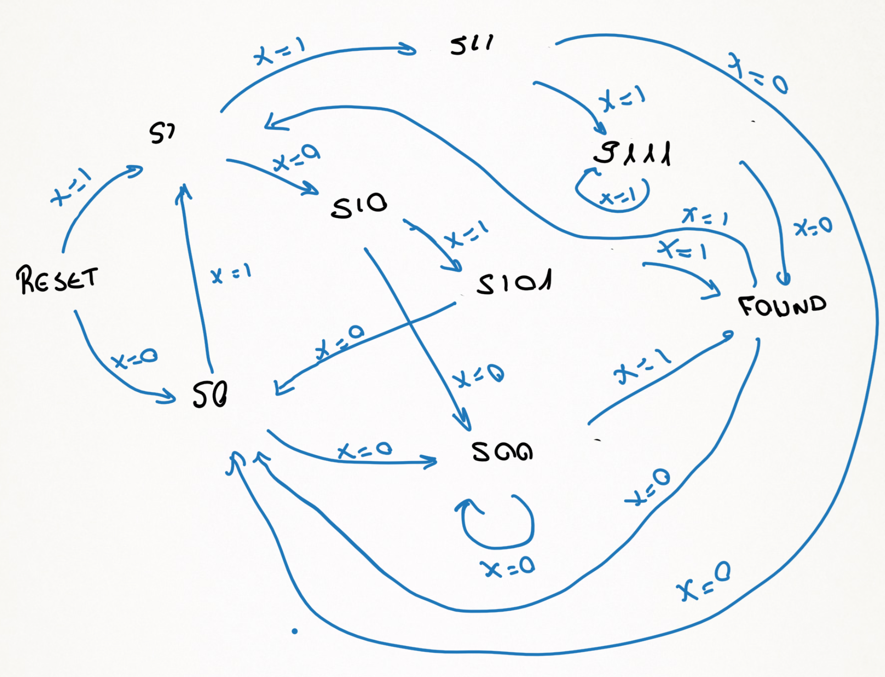

## Lab description
This project implements a finite state machine (FSM) in VHDL that detects the binary sequences "1110", "1011", and "001" from a serial input stream. When any of these patterns is detected, a flag output (*seq_detected*) is asserted for one clock cycle and a 32-bit counter (*seq_counter*) increments to record the total number of detected sequences. For design simplicity, overlapping sequences are intentionally not supported.

The state machine requires 11 states in total. These include a dedicated reset state, controlled by the rst signal, which also clears the counter, and a separate state used when a sequence is found, where the counter update occurs. To simplify implementation and improve synthesis behavior, an attribute is used to force one-hot state encoding.

The FSM is implemented as a Mealy machine, meaning the output depends on both the current state and the input signal. This allows the detection flag to be asserted in the same clock cycle that the last bit of a sequence is received, reducing latency. However, it can be easily converted into a Moore machine by modifying line 114 of sequences_generator.vhd so that the output depends on current_state instead of next_state, which would introduce a one-cycle delay. Finally, both output signals are registered on the rising edge of the clock, ensuring synchronous and stable operation.

## Verification description
The verification environment includes a dedicated testbench file (*_tb.vhd) and a run.sh script that automates compilation and simulation using GHDL, with waveform visualization through GTKWave. 

The current verification environment is intentionally simple and consists of a basic VHDL testbench that applies deterministic stimulus sequences and uses assertions to validate correct detection and counter behavior. It checks all supported patterns, verifies the no-detection condition, and confirms proper counter reset functionality. While this approach is sufficient for initial functional validation, a more advanced verification methodology is planned for future development using SystemVerilog, which will enable constrained-random testing, improved coverage, and a more scalable verification architecture.